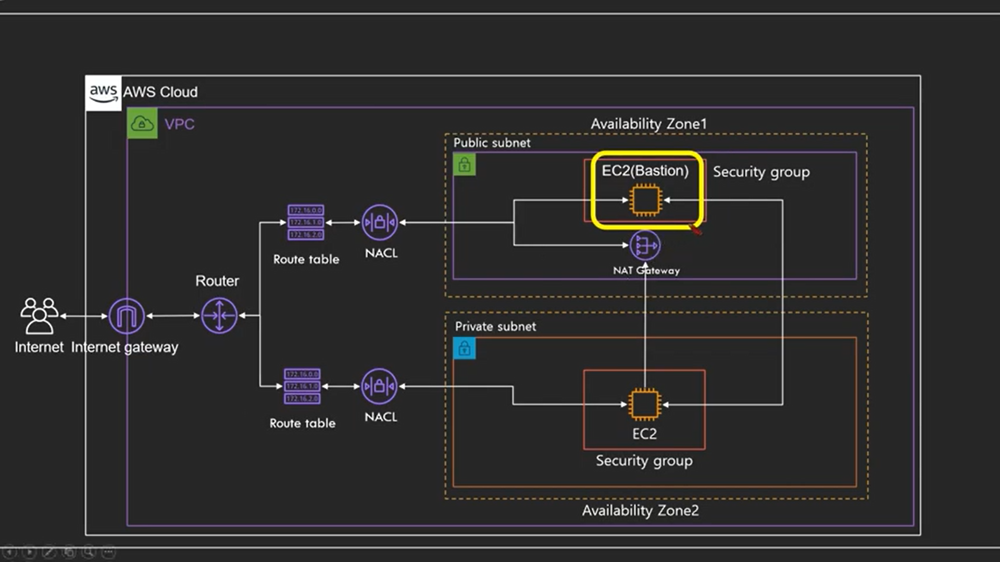
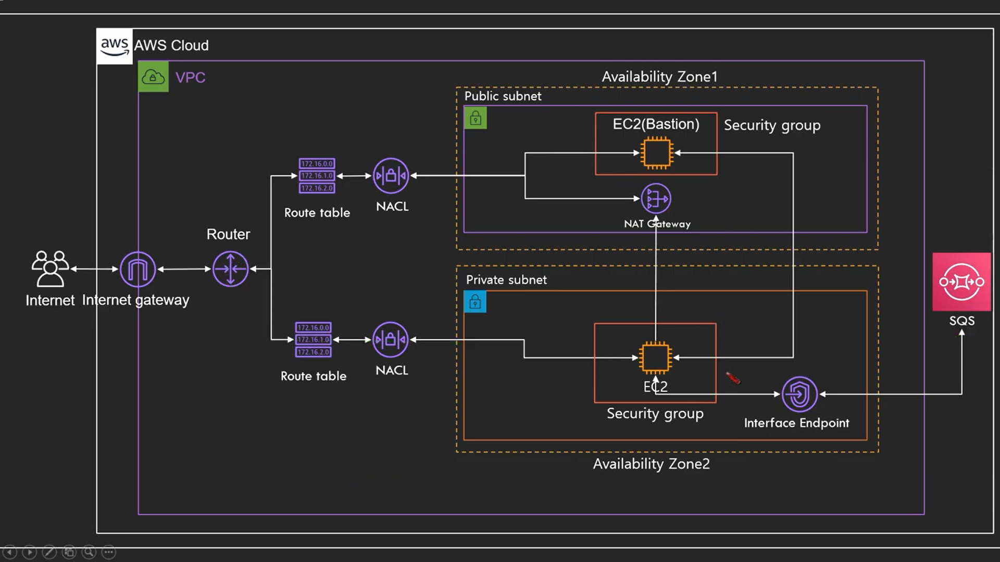
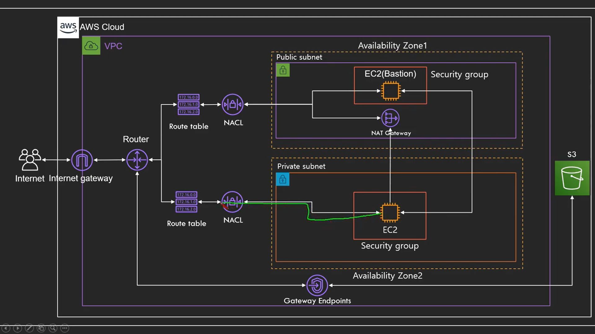

# VPC

논리적으로 격리된 공간을 프로비저인하여 고객이 정의하는 가상 네트워크 

VPC Peering: VPC간에 연결

*Transitive Peering 불가능 : A->B->C이면 A랑C가 연결x

1. AZ(Availability Zone)
   - 물리적으로 분류되어 있는 인프라가 모여 있는 데이터센터
   - 고가용성을 위해서 향상 일정 거리 이상 떨어짐
   - 하나의 리전은 2개 이상의 AZ로 이루어져 있음
   
2. Subnet
   - VPC의 하위 단위
   - 하나의 AZ에만 생성 가능: 다른 AZ 확장 불가
     - 하나의 AZ에는 여러 Subnet 생성 가능
   - Private Subnet : 인터넷에 접근 불가능한 Subnet 
   - Public Subnet
   - CIDR block range 설정 가능

3. Internet Gateway(IGW)
   - 인터넷으로 나가는 통로
   - 고가용성이 확보되어 있음
   - Route Table에서 연결해줘야 함
4. NACL(Network ACL)/Security Group
   - 검문소
   - NACL=>Stateless, SG=>Stateful
   - 기본적으로 VPC 생성시 만들어줌
   - Deny는 NACL에서만 가능

5. Route Table
   - 트래픽이 어디로 가야할지 알려주는 이정표
   - 기본적으로 VPC 생성시 만들어줌

6. 프라이빗 서브넷 EC2 접근하기(SG에서 인바운드에서 퍼블릿 주소만 들어갈수 있게 한다)

   - 퍼블릿 서브넷 주소 할당을 안하기 때문에 접근x

   - 해결책으로 bastion host과 nat 인스턴스/게이트웨어가 있다

   - 퍼블릿에 있는 넷게이트과 인스턴스한테 트래픽 부탁한다(같은 vpc안에 있기 때문에 서브넷끼리 통신가능) 

   - nat instance(EC2) vs nat gateway(AWS 서비스)

     - 요즘 nat gateway사용(고가용성)

   - bastion host 

     - 물론 퍼블릿에 위치함

     - nat과 다르게 client가 접근하기 위한것

       

7. VPC Endpoint

   - 트래픽이 바깥으로 나가지 않고 여러 서비스를 이용할 수 있게 하는것
   - 예를들어 프라이빗 서브넷에 설치된 EC2에서 AWS 서비스를 이용할 수 있는것(DynamoDB,RDB)
   - Interface Endpoint/Gateway Endpoint
     - Interface: Private ip를 만들어 서비스로 연결시켜줌
     - 
     - Gateway : 라우팅 테이블에서 결로의 대상으로 지정하여 사용(현재까지는 S3와 DynamoDB만 지원)
     - 

# 실습

1. **vpc생성**
   1. cidr 블록 설정
2.  **서브넷 생성**
   1. 퍼블릿(웹), 프라이빗(디비)
   2. vpc 설정
3. **인터넷 게이트웨이 생성**
   1. vpc 연결 (인터넷 게이트웨이는 vpc에 하나만 가능)
4. 라우트 테이블 설정(vpc 생성시 자동으로 생성됨)

   1. 기본적으로 만들어진 라우트 테이블은 프라이빗으로 쓰고 하나 더 만들어서 퍼블릿용으로 쓴다(보안측면을 위해 기본적으로 프라이빗으로 설정하는것)
   2. 각각의 라우터 테이블을 서브넷 연결
   3. 퍼블릿 라우팅 편집(트래픽 대상을 인터넷게이트웨이로 설정)
5. NACL 설정(vpc 생성시 자동으로 생성됨)

   1. 이또한 자동으로 생성된거를 프라이빗으로 쓰고 하나를 더 생성해서 퍼블릿 용으로 씀

   2. 인바운드/ 아웃바운드규칙 설정(규칙(순서), 유형,프로토콜,포트범위,소스, 허용/거부)
6. ec2 생성후 연결
   1. 프라이빗 서브넷 EC2 접근하기
      - 프라이빗 서브넷으로 한 ec2에서 보안그룹을 퍼블릿 보안그룹을 접근할 수 잇게 한다(이렇게 하면 퍼블릿 EC2에서 ssh를 통해 접근가능 단, 인터넷 연결은 안됨)
      - nat gateway를 설정(인터넷 연결을 하기 위해)
        - 서브넷 설정 : 퍼블릿 SG에 있어야함
        - 탄력적 IP할당
        - 라우팅 테이블 설정
          - 프라이빗 라우팅 편집(NAT gateway로 갈수 있게)

7. S3 gateway Endpoint

   1. IAM에서 EC2에서 S3를 접근할 수 있는 role을 설정

      - IAM->role->s3클릭->role 이름/설명 입력->s3에서 버킷 추가
      - vpc 들어간후 메뉴얼에 Endpoint 들어가서 s3 인터페이스 선택
      - 해당 vpc 설정 하고 프라이빗 서브넷에 설정
      - 라우팅 테이블로 가면 라우트가 설정된걸 확인 할 수 있음

      