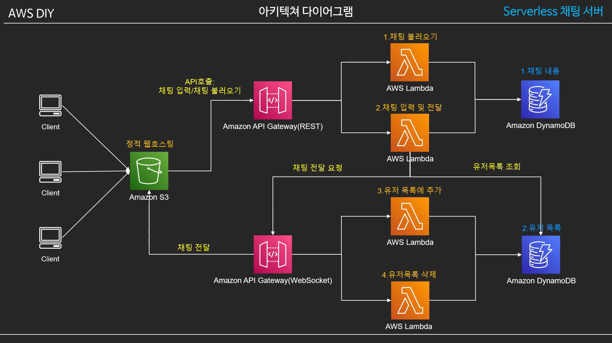

# S3 Static Hosting + Serverless 기반 채팅 서버

 

### S3을 통해 서버 없이 웹서버 호스팅하기

### 실습

1. S3 버킷 만들기
   - 모든 퍼블릭 액세스 차단 해제

2. S3 Static Hosting 설정

   - 버킷 Public Access 부여(메뉴얼 : 버킷들어가기->권환->버킷 정책)  - CloudFront를 통해 public access를 주지 않고도 웹 호스팅을 하는 방법이 있음

     - 위에서는 버킷을 퍼블릿 차단 해제만 한것이지 객체 접근에 대해 설정해 둔 것이 아님!!(기본적으로 모든 객체가 접근이 불가능한 상태임)

     - 버킷 정책 생성 - jons 형태
       - 오타가 생길 수 있기 때문에 **생성기**를 사용해서 생성

         ARN(Amazon Resource Name) - 모든 서비스와 리소스의 고유한 아이디

   - 버킷 Static Web Hosting 활성화(메뉴얼 : 속성->정적 웹사이트 호스팅)

     - 인덱스 문서와 오류문서 등록(예시 : index.html)

   - React를 호스팅하기 위해 에러 페이지 설정

3. 웹 페이지 업로드 후 호스팅 확인

   - 웹 파일 전부 업로드 (메뉴얼 : 개요 ->업로드)
   - 엔드포인트(링크) 접속 (메뉴얼 : 속성 -> 정적 웹 사이트 호스팅) - http
     - https를 사용할려면 CloudFront등의 서비스를 사용

4. Route53을 통해 도메인 부여

   - Route53 -> 레코드 세트 생성 -> 버킷등록

# Serverless 기반 채팅 서버 만들기

### 사용된 AWS 서비스

1. API Gateway
   - API형식으로 AWS 서비스에 접근할 수 있도록 해주는 서비스
   - Rest API 모듈
     - Lambda를 HTTP 프로토콜 기반의 REST API로 호출
   - WebSocket 모듈
     - WebSocket 프로토콜로 Lambda를 호출
     - WebSocket으로 붙을때 **ConnectionID**를 부여
     - ConnectionID로 구분 된 클라이언트에 메세지 전송 가능

2. Lambda
   - Serverless 기반으로 코드를 실행 할 수 있는 서비스
   - 총 4개의 Lambda 사용
     - 웹소켓 연결
       - ConnectionID를 DynamoDB에 저장
     - 웹소켓 해제
       - ConnectionID를 DynamoDB에서 삭제
     - 채팅 입력
       - DynamoDB에 채팅 내용 기록
       - 해당 방에 ConnectionID를 DynamoDB에서 불러와 채팅 내용을 API Gateway Websocket을 통해 전달
     - 채팅 가져오기
       - DynamoDB에서 채팅 내용을 가져오기

3. DynamoDB
   - Key-Value 기반의 nosql현채의 완전관리 Document DB
   - Serveless
   - 총 2개의 테이블
     - 채팅 메시지 : 채팅내용을 저장
     - 유저 목록 : 채팅방에서 접속된 유저들의 ConnectionID를 저장

4. S3
   - 객체 스토리지 서비스
   - Static Web Hosting

### 실습

1. IAM Role 생성
   - 로직을 처리할 Lambda에 권환을 부여하기 위해
   - 역할 만들기
     - 메뉴얼 : IAM -> 역할 -> 역할 만들기 -> Lambda -> dyanmodb,APIgateway/cloudwatch 추가
2. API Gateway 생성
   - REST API 생성
     - 메뉴얼 : API gateway -> RESTAPI -> 새 API생성 및 설정
   - WebSocket 생성
     - 메뉴얼 : API gateway -> WebSocket -> API 세부정보 지정(이름, 람다연동) 
3. Lambda 생성(4개)
   - API Gateway와 연동
   - 채팅을 넣고,가져오는 함수
     - 메뉴얼 : Lambda -> 함수 생성 -> 이름,런타임(node.js),iam 설정 -> 만들어진 함수에서 소스코드 파일 업로드
   - 채팅 메세지
   - Lambda 환경변수에 key와 API Gateway 생성된 ID 추가
4. DynamoDB 생성
5. 클라이언트 테스트
6. Serverless로 만들어보기

