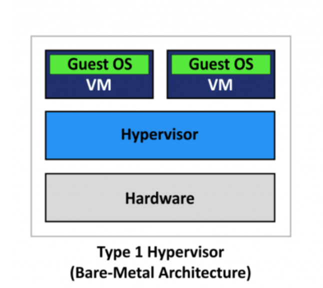
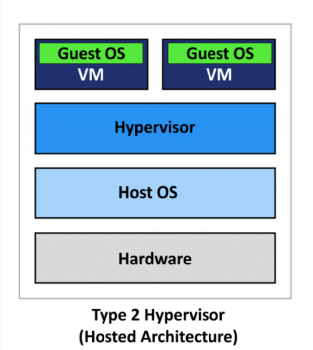
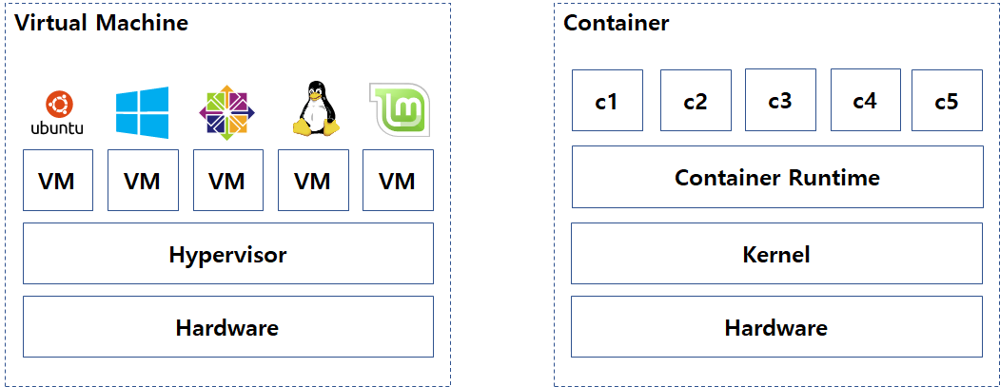

# 가상화와 화이퍼바이저

### 가상화란

물리적인 하드웨어 장치를 논리적인 단위로 나눠서 사용하는 것

### Hypervisor

호스트 컴퓨터에서 다수의 운영체제를 동시에 실행하기 위한 논리적인 플랫폼

### 가상화 장점

1. 비용절감
   - 하나의 컴퓨터에 여러개의 OS를 띄울 수 있으므로 하드웨어의 유지보수 비용 감소
2. 신속성
   - 하이퍼바이저 위에 생성된 VM들은 기존의 전체 환경을 **프로비저닝**하는 것보다 더 빠르게 동작
   - 프로비저닝 - 사용자의 요구에 맞게 시스템 자체를 제공하는 절차
3. 다운타임 최소화
   - 호스트가 다운되더라도 VM만 다른 Host로 이전시키면 되므로 장애 내구성 갖게 된다

### 하이퍼바이저 유형1 - 베어메탈

하드웨어 위에 하이퍼바이저를 설치하고 그 위에 바로 게스트OS를 올리는 형태

장점 - 게스트OS 하나에 문제가 발생하더라고 다른 게스트에는 영향을 끼치지 않는다

### 하이퍼바이저 유형2 - 호스트 하이퍼바이저

호스트 OS위에 하이퍼바이저를 설치하고 그 위에 게스트OS를 올리는 형태

게스트OS를 호스트OS에 의존하여 호스트OS에 장애나 업데이트시 게스트OS에도 영향을 끼침

### VM vs Container

|      | VM                                           | Container                                                    |
| ---- | -------------------------------------------- | ------------------------------------------------------------ |
|      | 각각의 VM에 OS,드라이버,메모리 할당          | 별도의 OS나 드라이버 없이 Host OS를 공유하는 형태            |
|      | 완전히 분리된 공간                           | 엄연히 따지면 완전히 분리된건 아니다                         |
|      | 모놀리식 아키텍처에서 사용                   | MSA 사용-컨테이너 오케스트레이션 기술로 여러개의 컨테이너를 쉽게 관리가 가능 |
| 장점 | 보안적 측명 , 각각의 VM에 별도의 OS사용 가능 | 빠른 배포,운영 / 이식성/ 신속성                              |

~~출처 https://blog.naver.com/jd0909/222141032465~~

