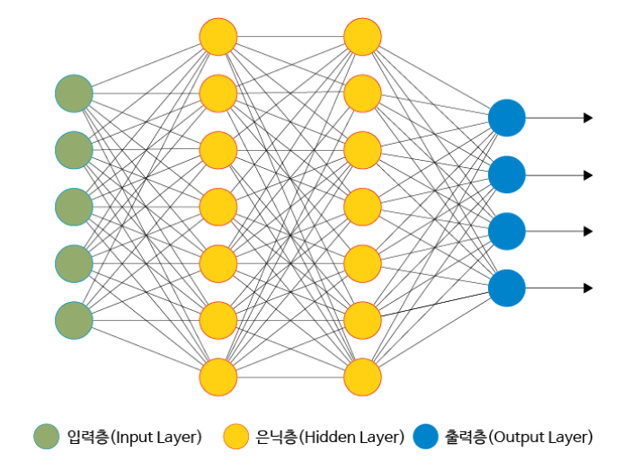

# 딥러닝

```
여러 층을 가진 인공신경망(ANN)을 사용하여 머신 러닝 학습을 수행하는 것으로 심층학습이라고도 부른다. 따라서 딥러닝은 머신러닝의 한 종류라고 할 수 있다.

기존의 머신러닝에는 학습하려는 데이터의 여러 특징 주에서 어떤 특징을 추출할지를 사람이 직접 분석하고 판단해야 했지만 딥러닝에서는 기계가 자동으로 학습하려는 데이터에서 특징을 추출하여 학습하게 됨

딥이라는 단어는 시간이 지나면서 축적되는 신경만의 여러 층을 의미하며, 신경망의 깊이가 깊어질수록 성능이 향상

이처럼 딥러닝과 머신러닝의 가장 큰 차이점은 바로 기계의 자가 학습 여부
```


- 인공신경망(Artificial Neural Network, ANN)

  ```
  딥러닝에서 가장 기본이 되는 개념은 바로 신경망이다
  신경망이란 인간의 뇌가 가지는 생물학적 특성 중 뉴런의 연결 구조를 가리키며 이러한 신경망을 본떠 만든 네크워크 구조를 인공신경망이라고 부른다
  ```

  

  ```
  인공신경망은 여러 누런이 서로 연결되어 있는 구조의 네트워크이며, 입력층을 통해 학습하고자 하는 데이터를 입력 받아 여러 단계의 은닉층을 지나면서 처리가 이루어져 출력층을 통해 최종 결과가 출력됨 이러한 3개 이상중첩한 구조를 깊은 신경망(Deep Neural Network,DNN)이라고 부름
  ```


<참고문헌>

https://ikkison.tistory.com/54?category=785277