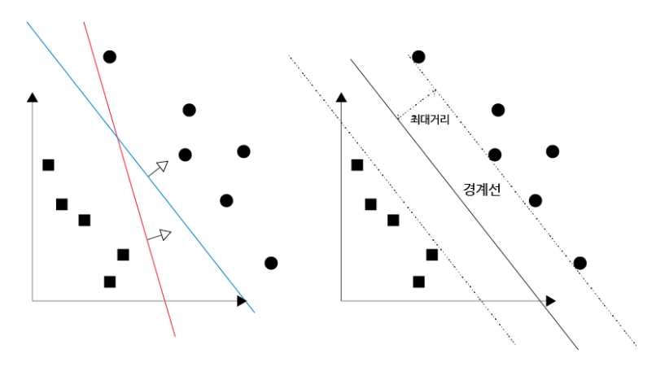
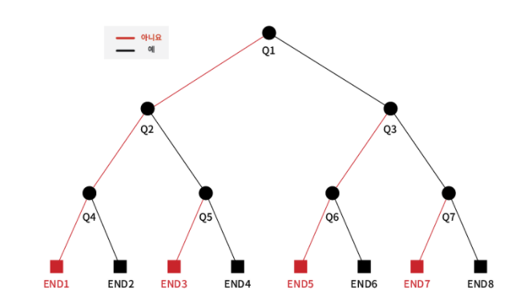

# 머신러닝


## 지도 학습 vs 비지도 학습

```
지도 학습과 비지도 학습이 학습 데이터가 주어진 상태에서 환경에 변화가 없는 정적인 환경에서 학습을 진행한다고 가정
```


### 1)  지도학습

```
여러 문제와 답(Lable)을 같이 학습함으로써 미지의 문제에 대한 올바른 답을 예측하고자 하는 방법(분류, 예측 모델로 나눌 수 있음)
```

​	

​	A.   분류 모델

```
- 주어진 데이터를 정해진 카테고리(라벨)에 따라 분류하는 모델을 말한다. 

- darknet의 YOLO, network architecture는 GoodLeNet for image classification를 	이용하여 이미지를 분류하고 있다. 

- 분류는 맞다, 아니다 등의 이진 분류 문제 또는 사과다 바나나다 포도다 등의 2가지 이상으로 분류하는 다중 분류 문제가 있습니다.

- 분류 모델의 결과값은 언제나 학습했던 데이터의 라벨 중 하나가 됩니다.

- 대표 알고리즘
KNN, 서포트 벡터 머신(SVM), 의사결정 트리
```


​	B.   예측(회귀) 모델

```
- 어떤 데이터들의 Feature를 기준으로, 연속된 값(그래프)을 예측하는 문제로 주로 어떤 패턴이나 트렌드, 경향을 예측할 때 사용된다

- 답이 분류 처럼 1, 0이렇게 딱 떨어지는 것이 아니고 어떤 수나 실수로 예측될 수 있다.

- 대표 알고리즘
Linear Regression, Linear Regression, Ridge, Lasso
```


 

 

### 2)  비지도 학습

```
- 지도 학습과는 달리 정답(Lable)이 없는 데이터를 비슷한 특징끼리 군집화 하여 새로운 데이터에 대한 결과를 예측하는 방법
- 인터넷에 있는 거의 모든 데이터가 레이블이 없는 형태이기 때문에 앞으로 기계학습이 나아갈 방향으로 설정될 듯
- 실제로 지도 학습에서 적절한 피처를 찾아내기 위한 전처리 방법으로 비지도 학습을 이용하기도 합니다.

- 대표 알고리즘
클러스터링, K Means, DBSCAN
```


​	A.   클러스터링

```
레이블이 없는 학습 데이터들의 특징을 분석하여 서로 동일하거나 유사한 특징을 가진 데이터끼리 그룹화 함으로써 레이블이 없는 학습 데이터를 군집으로 분류합니다. 그리고 새로운 데이터가 입력되면 지도 학습의 분류 모델처럼 학습한 군집을 가지고 해당 데이터가 어느 군집에 속하는지를 분석하는 것
```


- 군집의 타당성 평가

  ```
  비지도 학습에 사용되는 데이터에는 레이블이 없으므로, 지도 학습처럼 단순정확도를 지표로 그 정확도를 평가할 수 는 없습니다. 그래서 군집을 만든 결과가 얼마나 타당한지는 군집간의 거리, 군집의 지름, 군집의 분산도등을 종합하여 고려함 
  
  따라서 일반적으로 군집 간 분산이 최대가 되고 최소가 될 때 최적의 군집모양과 개수라고 판단하고 있음 
  ```

  

- 군집화의 분류

  - 분할 기법의 분집화

    ```
    각 그룹은 적어도 하나의 데이터를 가지고 있어야 하며 각 데이터는 정확히 하나의 그룹에 속해야 한다는 규칙을 가지고 데이터 집합을 작은 그룹으로 분할하는 방식
    (기법 종류) k-means, k-medoids, DBSCAN
    ```

    

  - 계층적 기법의 군집화

     ```
    군집화는 데이터 집합을 계층적으로 분해하는 방식으로 그 방식에 따라 또 다시 집괴적 군집화와 분할적 군비화로 나눔
    ```

 

- 군집화의 활용

  ```
  매우 다양한 분야에서 사용되고 있는 머신러닝 방법 
  
  1. 의학 분야
  특정 질병에 대한 공간 군집 분석을 통해 질병의 분포 면적과 확산 경로 등을 파악하는 역학 조사등에서 활용되고 있음
  
  2. 홍보 분야
  고객을 세분화할 때 군집화를 활용
  
  3. 통계 분야
  분석하고자 하는 데이터에 다양한 군집화 알고리즘과 방법론을 사용하여 데이터 분석에 활용해 나가는 추세
  ```


- 분포 추정

  ```
  군집화에서 더 나아가서, 데이터들이 쭉 뿌려져 있을 때 얘네들이 어떤 확률 분포에서 나온 샘플들인지 추정하는 문제
  ```

  

## 강화 학습

```
어떤 환경 안에서 정의된 주체가 현재의 상태를 관찰하여 선택할 수 잇는 행동들 중에서 가장 최대의 보상을 가져다주는지 행동이 무엇인지를 학습하는 것
즉, 현재의 상태에서 어떤 행동을 취하는 것이 최적인지를 학습하는 것
(지도학습과 비교하면 사람으로부터 학습을 받는 것이 아니라 변화된는 환경으로부터 보상을 받아 학습한다는 점)

이러한 강화 학습은 사람이 지식을 습득하는 방식 중 하나인 시행창오를 겪으며 학습하는 것과 매우 흡사하여 인공지능을 가장 잘 대표하는 모델로 알려져 있다.
```


- 강화 학습의 동작 순서

  ```
  1. 정의된 주체가 주어진 환경의 현재 상태를 관찰하여, 이를 기반으로 행동을 취함
  2. 이때 환경의 상태가 변화하면서 정의된 주체는 보상을 받게 됨
  3. 이 보상을 기반으로 정의된 주체는 더 많은 보상을 얻을 수 있는 방향으로 행동을 학습
  
  '관찰-행동-보상'에 이르는 일련의 과정을 경험이라고 부를 수 있음
  ```

  


​		

- 이용(exploitation)과 탐험(exploration) 사이의 균형

  ```
  경험을 통해 학습하는 강화 학습에서 최단 시간에 주어진 환경의 모든 상태를 관찰하고, 이를 기반으로 보상을 최대화할 수 있는 행동을 수행하기 위해서는 이용과 탐험 사이의 균형을 적절히 맞춰야 한다
  
  이용이란 현재까지의 경험 중 현 상태에서 가장 최대의 보상을 얻을 수 있는 행동을 수행하는 것을 의미하고, 이러한 다양한 경험을 쌓기 위해서는 새로운 시도가 필요한데 이러한 새로운 시도를 탐험이라고 한다.
  
  따라서 이용과 탐험 사이의 적절한 균형을 맞추는 것이 강화 학습의 핵심이 되는 것이다.
  ```

  

- 마르코프 결정 프로세스(MDP)

  ```
  강화 학습에서 보상을 최대화할 수 있는 방향으로 행동을 취할 수 있도록 이용과 탐험 사이의 적절한 균형을 맞추는데 사용되는 의사결정 프로세스
  ```

  

- 활용

  ```
  프로세스 제어, 네트워크 관리, 로봇 공학등 현재 다양한 분야에서 활용되고 있음
  ex) 알파고, 자율 주행 자동차, 드론 분야
  ```

  

## 반지도 학습

레이블이 있는 데이터와 없는 데이터를 모두를 활용해서 학습하는 것


## 머신러닝 알고리즘

- SVM(Support Vector Machine) - 지도학습(분류 모델)

  ```
  학습 데이터가 벡터 공간에 위채하고 있다고 생각하며 학습 데이터의 특징 수를 조절함으로써 2개의 그룹을 분류하는 경계선을 찾고, 이를 기반으로 패턴을 인식하는 방법
  - 두 그룹을 분류하는 경계선은 최대한 두 그룹에서 멀리 떨어져 있는 경계선을 구하게 되며, 이는 두 그룹과의 거리를 최대로 만드는 것이 나중에 입력된 데이터를 분류할 때 더 	높은 정확도를 얻을 수 있기 때문
  ```

  


- 의사 결정 트리(Decision tree) - 지도학습(분류, 회귀 모델 둘 다 적용 가능)

  ```
  귀납적 추론을 기반으로 하는 의사 결정 트리는 데이터를 분석하여 이들 사이에 존재하는 패턴을 시각적이고도 명시적인 방법으로 보여주는 지도 학습 알고리즘 중 하나
  - 일종의 질문을 던져 답을 얻음으로써 그 대상을 좁혀나가는 일조으이 '스무고개'와 비슷
  ```

  ```
  <분석 순서>
  1. 목표 속성과 이와 관계가 있는 후보 속성들을 선택
  2. 데이터를 분석하는 목적과 자료 구조에 따라 적절한 분리 기준과 정지 규칙을 정하여 트리 구조 작성
  3. 완성된 트리 구조에서 정확도를 떨어뜨리는 속성은 제거(pruning)
  ```

  ```
  <활용>
  환자의 과거 진료 기록을 토대로 증상을 유추하거나 대출을 위한 신용평가, 고객의 소비 행동 예측 등 다양한 분야에서 활용
  ```




- K-means 군집화(K-means clustering) - 비지도 학습(분할 기반의 군집화)

  ```
  <학습 순서>
  1. 총 n개의 데이터를 학습할 경우 n보다 작거나 같은 k를 결정한 후, 임의의 중심점을 k개 설정함
  2. 모든 학습 데이터는 k개의 중심점까지의 거리를 각각 계산한 후에 가장 가까운 중심점을 자신이 속한 군집의 중심점이라고 저장
  3. 각 군집에 속한 데이터에 저장된 중심점 좌표값들의 평균을 구한 뒤 이를 바탕으로 해당 군집의 새로운 중심점을 설정
  4. 새롭게 설정된 중심점을 가지고 2단계와 3단계를 다시 반복함
  5. 모든 학습 데이터가 자신이 속한 군집을 변경하지 않는 경우 학습을 완료함
  ```

  ```
  <장단점>
  장점 : 알고리즘의 개념이 매우 직관적이며, 학습을 위해 수행해야 할 데이터의 계산의 양이 매우 적다는 장점
  단점 :  구형이 아닌 군집에 대해서는 정확도가 떨어지며, 동떨어져 있는 데이터 즉 이상값에 매우 민감, 맨 처음에 결정한 군집의 개수인 k에 따라 결과값이 완전히 달라지는 경우도 발생
  ```

  ```
  <활용>
  시장 분석, 이미지 작업, 지질 통계학, 천문학 등 광범위한 분야에서 활용,
  특히 다른 알고리즘을 수행하기 전에 학습 데이터를 전처리하는 용도로 많이 사용되고 있다
  ```

  

 

 

 

<참고문헌>

https://ikkison.tistory.com/51?category=785277

 